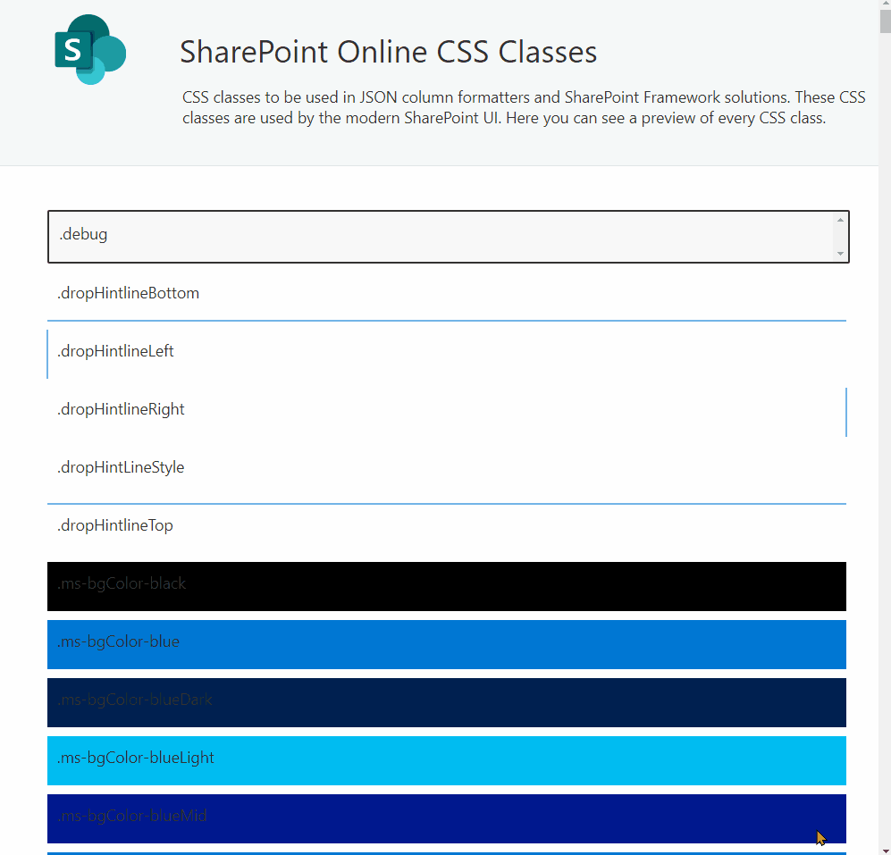

 

 
 

# Reusable SharePoint Online CSS Classes for Modern UI

CSS classes to be used in JSON column formatters and SharePoint Framework solutions. These CSS classes are used by the modern SharePoint UI. Here you can see a preview of every CSS class.

## [🔍 Browse the full list of SharePoint Online CSS classes](https://zerg00s.github.io/sp-modern-classes/)

 

