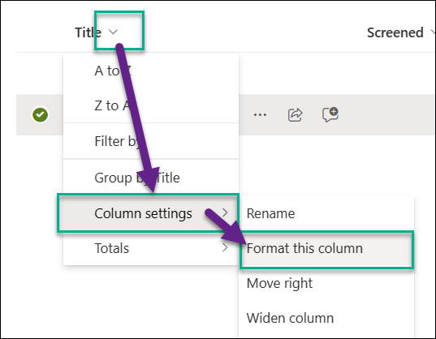
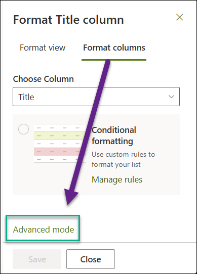
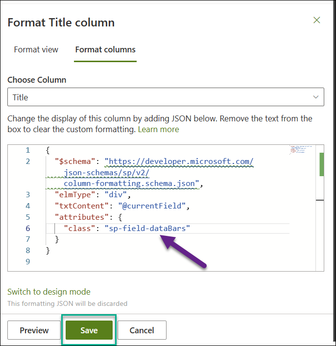
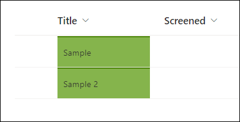

 

 
 

# Reusable SharePoint Online CSS Classes for Modern UI

CSS classes to be used in JSON column formatters and SharePoint Framework solutions. These CSS classes are used by the modern SharePoint UI. Here you can see a preview of every CSS class.

<hr>

## [🔍 Browse the full list of SharePoint Online CSS classes](https://zerg00s.github.io/sp-modern-classes/)

<br>


## How do I use these CSS classes?
### Column formatting, view formatting, form formatting
You can use column and view formatting to customize how fields in SharePoint lists and libraries are displayed. To do this, you construct a JSON object that describes the elements that are displayed when a field is included in a list view, and the styles to be applied to those elements.

#### Sample JSON formatting for a SharePoint Title field:
- Format a column



- Advanced mode



- Apply a sample sp-field-dataBars CSS class to the Title field:

```json
{
  "$schema": "https://developer.microsoft.com/json-schemas/sp/v2/column-formatting.schema.json",
  "elmType": "div",
  "txtContent": "@currentField",
  "attributes": {
    "class": "sp-field-dataBars"
  }
}
```



- Result:



#### Read more on JSON formatting:
- [Column formatting](https://learn.microsoft.com/en-us/sharepoint/dev/declarative-customization/column-formatting)
- [View formatting](https://learn.microsoft.com/en-us/sharepoint/dev/declarative-customization/view-formatting)
- [Form formatting](https://learn.microsoft.com/en-us/sharepoint/dev/declarative-customization/form-formatting)
- [Column formatting samples](https://github.com/pnp/List-Formatting). This is a open source repository to share different kind of formatting json files between community. Check column-samples, view-samples or form-samples folder for what's currently available. Have you build one which you can share? - We do welcome contributions.


### SPFx Webparts
In SPFx web parts, you can reuse the classes by using the className attribute. For example, to apply a border to a field, you can use the sp-field-borderAllDashed class:

```html
<div className={`sp-field-dataBars sp-field-borderAllDashed`}>
```


## Conclusion
I hope you find this collection of reusable CSS classes helpful. If you have any questions or suggestions, please leave a comment below. 🙏
